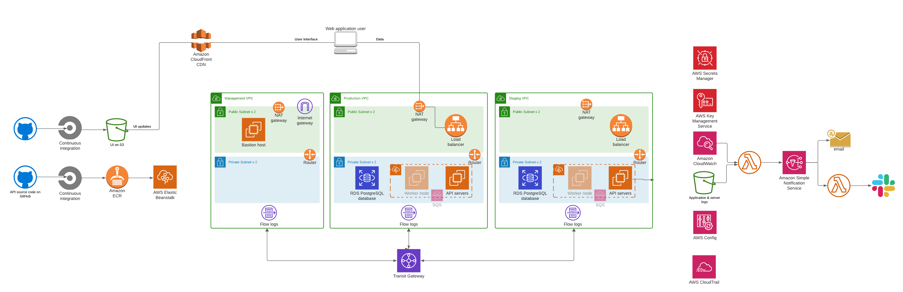

# Reference architecture for application deployment on AWS

## AWS architecture

The AWS environment is partly based on [AWS's reference architecture for HIPAA compliance](https://aws.amazon.com/solutions/implementations/compliance-hipaa/), and is suitable for applications that require HIPAA compliance. Using this architecture does not in itself ensure compliance. The deployment architecture used here differes from AWS's reference architecture in that it supports internet-facing web applications.



### Points of interest

- There are three VPCs: production, staging, and management.
- Each VPC has two private and two public subnets, covering two availability zones for redundancy.
- API deployment is managed by Elastic Beanstalk.
- The UI is deployed on CloudFront, with an S3 origin.
- Application logs are written to a CloudWatch log group.


## Parameters

In the documentation below and in some accompanying templates, we use the following paramters as placeholders for application-specific values:

- {aws-account-id}: The ID of your AWS account, typically a 12-digit numeral
- {ecr-repo-name}: The ECR repository name, which is typically the application name
- {container-name}: The name you want to use for the application's main Docker container, which is also typically the application name
- {organization}: An organization name, used as a prefix for globally-named resources like S3 buckets
- {project}: The project name
- {module}: A module name within the project, e.g. "api," "worker," or something application-specific
- {ui-dist-id-prod}: A CloudFront distribution ID used for the production instance's UI
- {ui-dist-id-staging}: A CloudFront distribution ID used for the staging instance's UI

## AWS environment creation

The network environment shown in the figure above is instantiated using a CloudFormation template, [network.template.yaml](environments/aws/templates/network.template.yaml). Other resources -- including the bastion host, the RDS database, and the Elastic Beanstalk environment -- are currently created manually but should be moved into templates.

1. Upload the contents of the [aws](environments/aws) directory to the S3 bucket named `{organization}-{project}-aws-templates` in a folder named `{project}-network`.

2. In AWS's `us-west-2` (Oregon) region, create a CloudFormation stack using the main template ([network.template.yaml](environments/aws/templates/network.template.yaml)). This will create several substacks.

    - Create the stack using `https://{organization}-{project}-aws-templates.s3.us-west-2.amazonaws.com/{project}-network/templates/network.template.yaml` as the template source.
    - Accept all of the default parameter values, except for the following parameters:
        - **Stack name:** `{project}-network`
        - **AWS Config service-linked-role ARN:** Obtain this from the AWS console for IAM; look for the ARN of the role named AWSServiceRoleForConfig. If this does not exist yet, you may need to enable AWS Config.
        - **SNS alarm-notification email address:** The email address who should receive alarms
        - **Quick Start S3 bucket name:** `{organization}-{project}-aws-templates`
        - **Quick Start S3 key prefix:** `{project}-network/`

3. Create the other resources manually. Follow the instructions at [environments/aws/procedure.md](environments/aws/procedure.md).

## Access

### Database access

The database has three layers of security:

1. The database itself requires a username and password. The API uses a service role, but individual roles are created for users.
2. The database can only be reached through the bastion server. Each user will be issued an account on the bastion server.
3. And the bastion server's security group, `{project}-bastion-sg`, can be used to restrict access by IP address.

To get connected, obtain the following credentials:

- PostgreSQL username and password
- Bastion username and SSH key

Then follow the guide at [environments/aws/db-access.md](environments/aws/db-access.md).

### Server

You can also log into EC2 servers managed by Elastic Beanstalk.

First obtain the following credentials:

- PostgreSQL username and password
- Your bastion username and SSH key
- And the root (ec2-user) SSH key for application servers

In addition, you must obtain the current internal IP address of the server you want to log into.

TODO Provide instructions for setting up AWS credentials and getting the server IP address.

TODO Provide instructions for configuring SSH access to the server.

## Application deployment

### Prerequisites

Install Docker Desktop on your local machine.

Install the AWS Command-line interface (CLI) on your local machine.

Obtain an AWS IAM account with appropriate privileges, and on your local machine, store them in an AWS CLI profile named `{project}-prod-deployment`:

```
aws configure --profile {project}-prod-deployment
```

Enter the credentials when prompted.

Set up a second profile named `{project}-staging-deployment`. 
You may use the same credentials or credentials for a different IAM account with more limited access:

```
aws configure --profile {project}-staging-deployment
```

### Production deployment on AWS

#### Server module production deployment on AWS

Here we deploy an API service. The module is assumed to be named `api`.

##### 1. Build the Docker image:

```
cd {project}-api
docker build --tag {project}-api .
```

##### 2. Give ECR credentials to your Docker service

This allows Docker to push images to the {project}-api ECR repository.

The following command accomplishes this without exposing credentials in your shell environment:

```
aws ecr get-login-password --region us-west-2 —profile {project}-prod-deployment | docker login --username AWS --password-stdin 973319986906.dkr.ecr.us-west-2.amazonaws.com
```

However, the command above does not work well with some versions or the AWS CLI, so the same thing can be accomplished in two steps:

```
export ECRPASSWORD=$(aws ecr get-login-password --region us-west-2 --profile {project}-prod-deployment)

echo $ECRPASSWORD | docker login --username AWS --password-stdin 973319986906.dkr.ecr.us-west-2.amazonaws.com
```

##### 3. Push the Docker image to Elastic Container Repository (ECR).

```
docker tag {project}-api:latest 973319986906.dkr.ecr.us-west-2.amazonaws.com/{project}-api

docker push 973319986906.dkr.ecr.us-west-2.amazonaws.com/{project}-api
```

##### 4. Deploy the new version to Elastic Beanstalk.

Configuration files are stored in this repository at [targets/prod-service](targets/prod-service).

```
cd targets/prod-service

eb deploy
```

#### UI production deployment on AWS

In this section,w e deploy a static user interface, typically for a single-page application written using a framework like Vue.js or React.js, which consumes the API. The module is assumed to be named `ui`.

##### 1. Build the user interface:


```
cd {project}-ui
git checkout main
rm -rf dist node_modules
npm i
npm run build
```

This build process creates a static set of files in `dist`.

##### 2. Upload the user interface to S3:

```
aws s3 rm s3://bbi-{project}-prod-ui --recursive --profile {project}-prod-deployment
aws s3 sync ./dist s3://bbi-{project}-prod-ui --profile {project}-prod-deployment
```

##### 3. Invalidate the CloudFront distribution's contents.

If you skip this step, it may be up to a day before users in a given region receive the updated UI.

```
aws cloudfront create-invalidation --distribution-id {ui-dist-id-prod} --paths "/*" --profile {project}-prod-deployment
```

### Staging environment deployment on AWS

#### API staging environment deployment on AWS

Here we deploy an API service. The module is assumed to be named `api`.

##### 1. Build the Docker image:

```
cd {project}-api
docker build --tag {project}-api:staging .
```

##### 2. Give ECR credentials to your Docker service

This allows Docker to push images to the {project}-api ECR repository.

The following command accomplishes this without exposing credentials in your shell environment:

```
aws ecr get-login-password --region us-west-2 —profile {project}-staging-deployment | docker login --username AWS --password-stdin 973319986906.dkr.ecr.us-west-2.amazonaws.com
```

However, the command above does not work well with some versions or the AWS CLI, so the same thing can be accomplished in two steps:

```
export ECRPASSWORD=$(aws ecr get-login-password --region us-west-2 --profile {project}-staging-deployment)

echo $ECRPASSWORD | docker login --username AWS --password-stdin 973319986906.dkr.ecr.us-west-2.amazonaws.com
```

##### 3. Push the Docker image to Elastic Container Repository (ECR).

```
docker tag {project}-api:latest 973319986906.dkr.ecr.us-west-2.amazonaws.com/{project}-api:staging

docker push 973319986906.dkr.ecr.us-west-2.amazonaws.com/{project}-api:staging
```

##### 4. Deploy the new version to Elastic Beanstalk.

Configuration files are stored in this repository at [targets/prod-api](targets/prod-api).

```
cd targets/staging-api

eb deploy
```

#### UI staging deployment on AWS

In this section,w e deploy a static user interface, typically for a single-page application written using a framework like Vue.js or React.js, which consumes the API. The module is assumed to be named `ui`.

##### 1. Build the user interface:


```
cd {project}-ui
git checkout main
rm -rf dist node_modules
npm i
npm run build
```

This build process creates a static set of files in `dist`.

##### 2. Upload the user interface to S3:

```
aws s3 rm s3://bbi-{project}-prod-ui --recursive --profile {project}-staging-deployment
aws s3 sync ./dist s3://bbi-{project}-staging-ui --profile {project}-staging-deployment
```

##### 3. Invalidate the CloudFront distribution's contents.

If you skip this step, it may be up to a day before users in a given region receive the updated UI.

```
aws cloudfront create-invalidation --distribution-id {ui-dist-id-staging} --paths "/*" --profile {project}-staging-deployment
```
